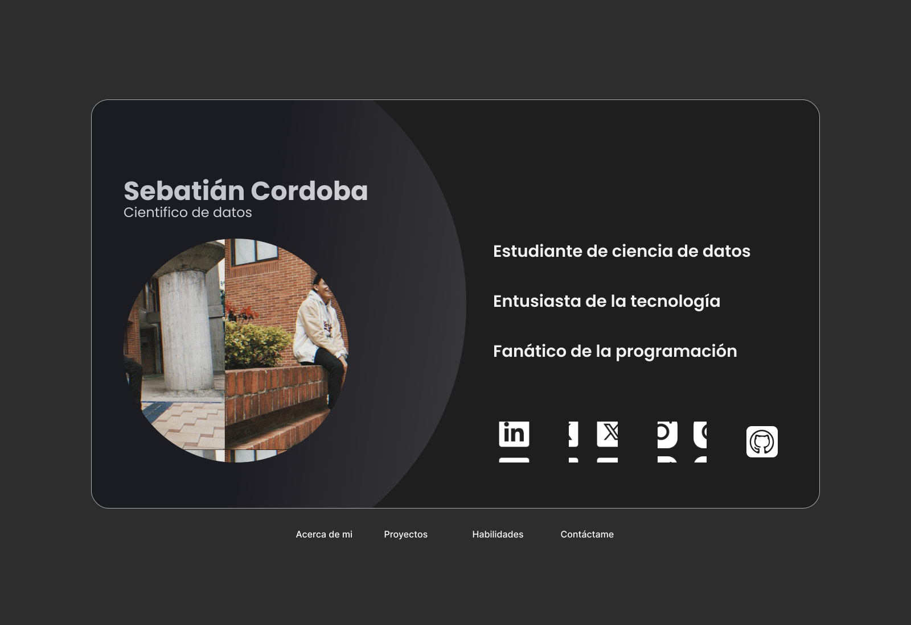

# Mi Portafolio Personal

Este es el código fuente de mi portafolio personal, diseñado para mostrar mis habilidades como Científico de Datos y desarrollador de software. A través de esta web, podrás conocer más sobre mí, mis proyectos, habilidades y cómo contactarme.

 <!-- Añade una captura de pantalla de tu portafolio -->

## 📝 Descripción

Este portafolio está diseñado para proporcionar una vista detallada de mis capacidades técnicas y experiencia en diferentes áreas, incluyendo:

- **Ciencia de Datos**: Proyectos en Python, R, y aplicaciones prácticas de aprendizaje automático y estadística.
- **Desarrollo de Software**: Proyectos de desarrollo web, aplicaciones móviles y análisis de datos.
- **Contactar conmigo**: Formas de contactarme a través de LinkedIn, GitHub, Twitter y correo electrónico.

## 🚀 Tecnologías Utilizadas

Este portafolio está desarrollado utilizando las siguientes tecnologías:

- **React**: Para la construcción de la interfaz de usuario.
- **CSS3**: Para el diseño y estilos personalizados de las páginas.
- **React Router**: Para la navegación entre diferentes secciones del portafolio.
- **JavaScript (ES6+)**: Para la lógica del frontend.
- **Firebase Hosting**: Para el despliegue del proyecto.

## 📂 Estructura del Proyecto

La estructura de carpetas del proyecto es la siguiente:

```
|-- /src
|   |-- /assets            # Archivos multimedia (imágenes, logos, etc.)
|   |-- /components        # Componentes React individuales
|   |   |-- /Principal      # Componente para la página principal
|   |   |-- /Proyectos      # Componente para la sección de Proyectos
|   |   |-- /Habilidades    # Componente para la sección de Habilidades
|   |   |-- /Contactame     # Componente para la sección de Contacto
|   |-- /styles            # Archivos CSS con sufijos para evitar colisiones
|-- App.js                 # Archivo principal del proyecto
|-- index.js               # Punto de entrada del proyecto
|-- README.md              # Documentación del proyecto
```

## 🚀 Instalación y Ejecución

Sigue los siguientes pasos para ejecutar el proyecto en tu entorno local.

### Prerrequisitos

Asegúrate de tener instalado **Node.js** y **npm** o **yarn** en tu sistema.

### Instalación

1. Clona este repositorio en tu máquina local.

```bash
git clone https://github.com/tu-usuario/portfolio.git
```

2. Navega al directorio del proyecto.

```bash
cd portfolio
```

3. Instala las dependencias.

```bash
npm install
# o
yarn install
```

### Ejecución

1. Inicia la aplicación en modo desarrollo.

```bash
npm start
# o
yarn start
```

2. Abre tu navegador y visita `http://localhost:3000` para ver el portafolio en acción.

## 🖼 Funcionalidades

### 🌟 Animaciones

El proyecto cuenta con animaciones suaves para mejorar la experiencia de usuario:

- **Transiciones de fade-in**: En las diferentes secciones del portafolio.
- **Animación de rotación**: El fondo tiene una rotación animada para agregar dinamismo.
- **Efecto de rebote**: Los elementos importantes, como la imagen de perfil, tienen efectos de rebote para destacarse.

### 🚀 Secciones

- **Acerca de mí**: Un resumen de mi experiencia y habilidades.
- **Proyectos**: Una colección de mis proyectos más destacados.
- **Habilidades**: Muestra de mis competencias en tecnologías clave.
- **Contáctame**: Formas de contactarme a través de redes sociales.

## 📧 Contacto

Si deseas saber más sobre mí o trabajar juntos en algún proyecto, puedes contactarme a través de:

- [LinkedIn](https://www.linkedin.com/in/juan-sebastian-cordoba-valderrama-a6a4062ab)
- [GitHub](https://github.com/SebasRubik)
- [Correo Electrónico](mailto:juans-cordoba@javeriana.edu.co)

## 📌 To-Do

- [ ] Mejorar la versión móvil del portafolio.
- [ ] Añadir más animaciones a la sección de Proyectos.

